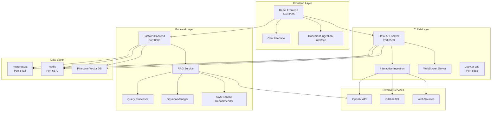
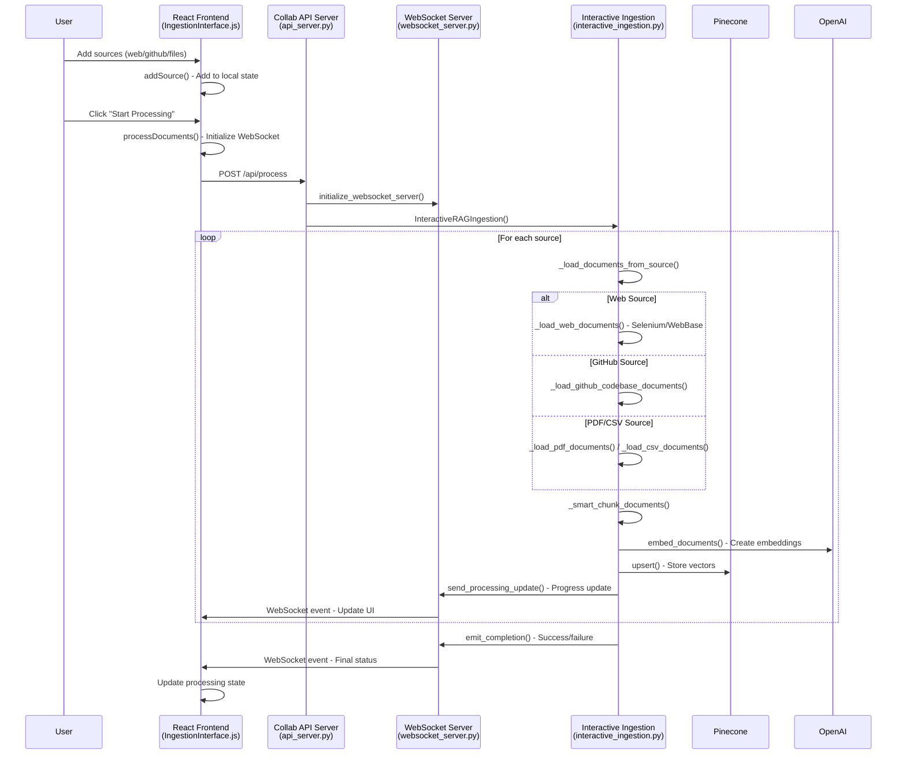
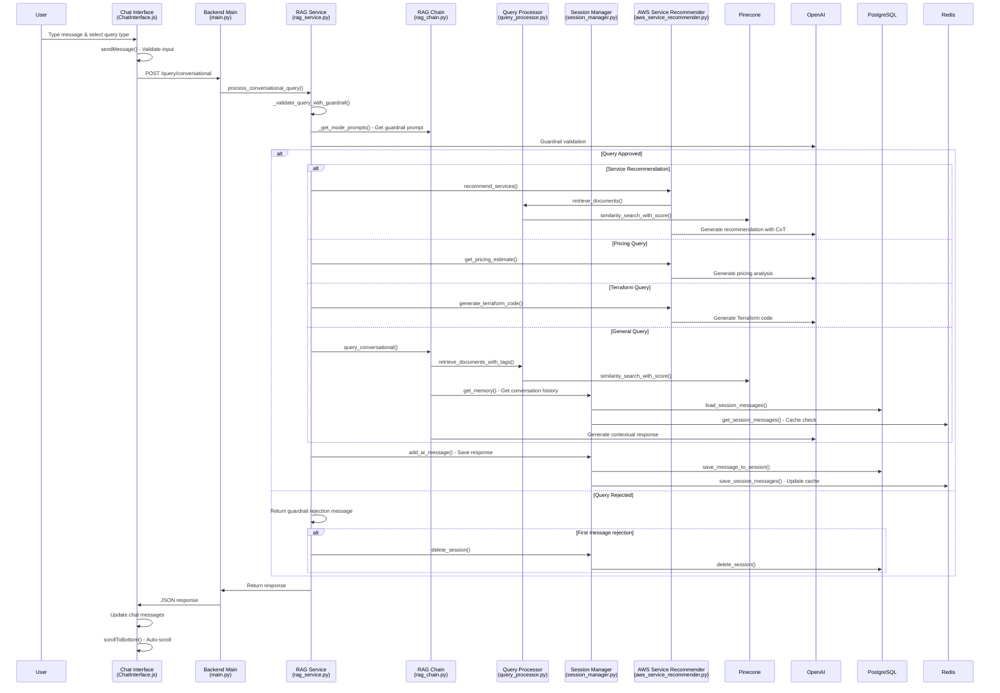
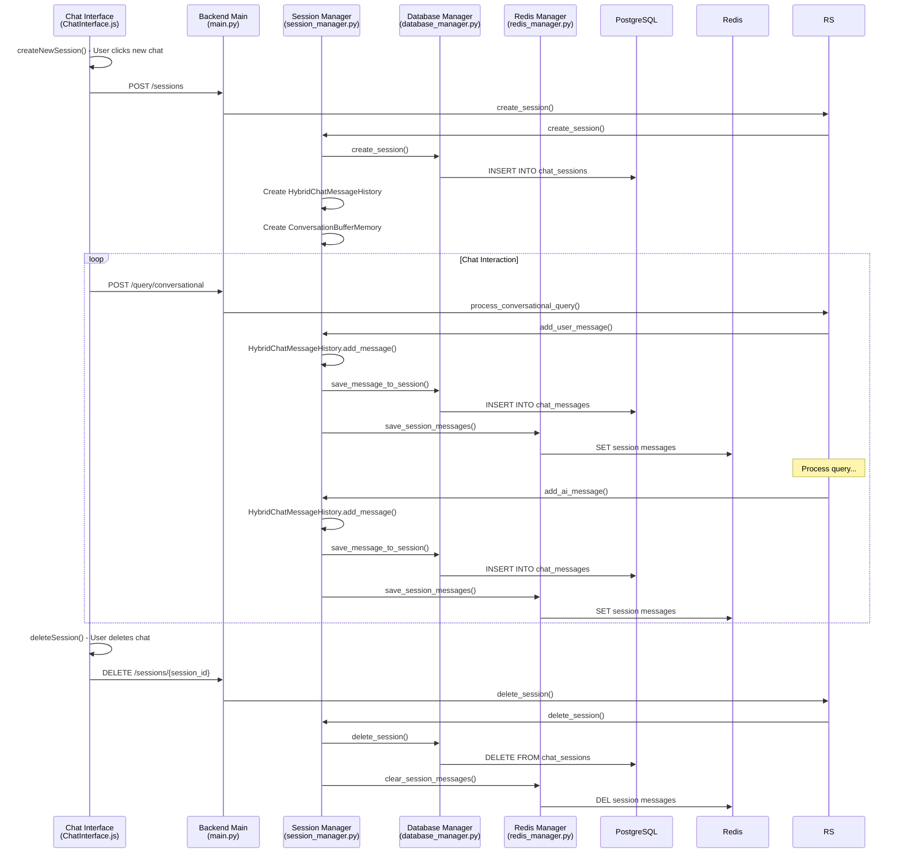
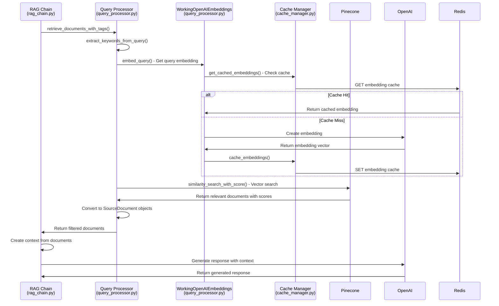

# GenAI-Powered DevOps Cloud Assistant - Comprehensive Architectural Review

## Executive Summary

The GenAI-Powered DevOps Cloud Assistant is a sophisticated full-stack application that provides AWS infrastructure guidance through conversational AI. The system employs a clean three-tier architecture with clear separation of concerns: document ingestion (Collab), API processing (Backend), and user interface (Frontend).

## 🏗️ System Architecture Overview



## 📊 Function-Level Flow Analysis

### 1. Document Ingestion Flow



**Key Functions:**
- `processDocuments()` in **IngestionInterface.js** - Orchestrates ingestion
- `process_documents()` in **interactive_ingestion.py** - Core processing logic
- `_smart_chunk_documents()` in **interactive_ingestion.py** - Intelligent chunking
- `embed_documents()` in **WorkingOpenAIEmbeddings** - Vector creation
- `send_processing_update()` in **websocket_server.py** - Real-time updates

### 2. Chat Query Processing Flow



**Key Functions:**
- `sendMessage()` in **ChatInterface.js** - User input handling
- `process_conversational_query()` in **rag_service.py** - Main query orchestration
- `_validate_query_with_guardrail()` in **rag_service.py** - Content filtering
- `query_conversational()` in **rag_chain.py** - RAG processing
- `retrieve_documents_with_tags()` in **query_processor.py** - Smart retrieval
- `recommend_services()` in **aws_service_recommender.py** - Service recommendations

### 3. Session Management Flow



**Key Functions:**
- `createNewSession()` in **ChatInterface.js** - UI session creation
- `create_session()` in **session_manager.py** - Session initialization
- `HybridChatMessageHistory` in **session_manager.py** - Dual storage system
- `save_message_to_session()` in **database_manager.py** - Persistent storage
- `save_session_messages()` in **redis_manager.py** - Cache management

### 4. Vector Retrieval & RAG Flow



**Key Functions:**
- `retrieve_documents_with_tags()` in **query_processor.py** - Smart document retrieval
- `embed_query()` in **WorkingOpenAIEmbeddings** - Query vectorization
- `similarity_search_with_score()` in **query_processor.py** - Vector similarity search
- `get_cached_embeddings()` in **cache_manager.py** - Embedding cache management

## 🔧 Core Components Analysis

### Backend Components

| Component | File | Key Functions | Purpose |
|-----------|------|---------------|---------|
| **Main API** | `main.py` | `conversational_query()`, `one_time_query()`, `create_session()` | FastAPI endpoints and request handling |
| **RAG Service** | `rag_service.py` | `process_conversational_query()`, `_validate_query_with_guardrail()` | Core business logic orchestration |
| **RAG Chain** | `rag_chain.py` | `query_conversational()`, `_create_prompt_templates()` | LangChain RAG implementation |
| **Query Processor** | `query_processor.py` | `retrieve_documents()`, `similarity_search_with_scores()` | Vector search and document retrieval |
| **Session Manager** | `session_manager.py` | `create_session()`, `add_message()`, `get_memory()` | Conversation state management |
| **AWS Recommender** | `aws_service_recommender.py` | `recommend_services()`, `get_pricing_estimate()` | Specialized AWS guidance |
| **Database Manager** | `database_manager.py` | `create_session()`, `save_message_to_session()` | PostgreSQL operations |
| **Redis Manager** | `redis_manager.py` | `get_cached_embeddings()`, `save_session_messages()` | Redis cache operations |
| **Cache Manager** | `cache_manager.py` | `get_semantic_cache()`, `cache_semantic_response()` | Multi-layer caching |
| **Error Handler** | `error_handler.py` | Error handling and logging | System reliability |

### Frontend Components

| Component | File | Key Functions | Purpose |
|-----------|------|---------------|---------|
| **App** | `App.js` | Main application routing | Application structure |
| **Chat Interface** | `ChatInterface.js` | `sendMessage()`, `createNewSession()`, `loadSessions()` | Main chat functionality |
| **Ingestion Interface** | `IngestionInterface.js` | `processDocuments()`, `addSource()`, WebSocket handling | Document ingestion UI |
| **Query Type Selector** | `QueryTypeSelector.js` | Query type selection | Specialized query modes |

### Collab Components

| Component | File | Key Functions | Purpose |
|-----------|------|---------------|---------|
| **API Server** | `api_server.py` | `process_documents()`, `upload_file()`, WebSocket events | Document processing API |
| **Interactive Ingestion** | `interactive_ingestion.py` | `process_documents()`, `_smart_chunk_documents()` | Core ingestion logic |
| **WebSocket Server** | `websocket_server.py` | `send_processing_update()`, `emit_completion()` | Real-time communication |
| **Selenium Web Loader** | `selenium_web_loader.py` | `load_url_with_js_wait()`, JavaScript handling | Enhanced web scraping |
| **Models** | `models.py` | Data models and source creation | Data structure definitions |
| **Config** | `config.py` | Configuration management | System configuration |

## 🚀 Key Features & Capabilities

### 1. Multi-Modal Query Processing
- **General Queries**: Standard AWS/DevOps questions with comprehensive responses
- **Service Recommendations**: Chain-of-Thought reasoning for optimal service selection
- **Pricing Estimates**: Detailed cost analysis with optimization strategies
- **Terraform Generation**: Production-ready Infrastructure-as-Code creation

### 2. Intelligent Document Processing
- **Smart Chunking**: Context-aware document segmentation based on content type
- **Multi-Source Support**: Web (with JavaScript), GitHub repositories, PDF, CSV files
- **Real-time Processing**: WebSocket-based progress updates with detailed logging
- **Metadata Enhancement**: Priority, category, and custom tag system for better retrieval

### 3. Advanced Session Management
- **Hybrid Storage**: Redis cache for speed + PostgreSQL for persistence
- **Conversation Memory**: LangChain ConversationBufferMemory integration
- **Multi-tab Support**: Independent conversation contexts per session
- **Guardrail System**: Content validation with context-aware filtering

### 4. Performance Optimization
- **Semantic Caching**: Embedding and response caching for faster queries
- **Connection Pooling**: Optimized database connections
- **Lazy Loading**: On-demand component initialization
- **Fallback Mechanisms**: Graceful degradation with multiple retry strategies

## 🔒 Security & Validation

### Guardrail System Implementation

The system implements a sophisticated guardrail mechanism in `rag_service.py`:

```python
async def _validate_query_with_guardrail(self, query: str, session_id: Optional[str], query_type: str):
    # Mode-specific guardrail prompts for different query types
    # Context-aware validation considering conversation history
    # Automatic session cleanup on first message rejection
    # Graceful error handling with user-friendly messages
```

### Content Filtering Features
- **Query Type Validation**: Mode-specific content checks (general, service_recommendation, pricing, terraform)
- **Context-Aware Filtering**: Considers previous conversation context for better validation
- **Session Management**: Automatic cleanup on policy violations
- **Error Handling**: Graceful degradation with informative user feedback

### Security Measures
- **API Key Management**: Secure environment variable handling
- **Input Sanitization**: Comprehensive input validation
- **Rate Limiting**: Built-in FastAPI rate limiting capabilities
- **CORS Configuration**: Proper cross-origin resource sharing setup

## 📈 Performance Metrics & Optimization

### Response Times
- **Cached Queries**: ~100-200ms (Redis cache hits)
- **Simple Queries**: ~2-5 seconds (with vector search)
- **Complex Recommendations**: ~5-10 seconds (with CoT reasoning)
- **Document Ingestion**: Variable (depends on source size and type)

### Scalability Features
- **Horizontal Scaling**: Stateless backend design with Docker containers
- **Caching Strategy**: Multi-layer caching (Redis, Semantic, Embedding)
- **Database Optimization**: Connection pooling, proper indexing, query optimization
- **Resource Management**: Graceful resource cleanup and memory management

### Performance Optimizations
- **Async Processing**: Full async/await implementation throughout the stack
- **Connection Reuse**: HTTP client reuse for external API calls
- **Batch Processing**: Efficient batch operations for embeddings and database writes
- **Smart Retrieval**: Tag-based filtering to reduce vector search scope

## 🔄 Data Flow Architecture

### Request Processing Pipeline
1. **Frontend Validation** → Input sanitization and query type selection
2. **Backend Routing** → FastAPI endpoint routing with proper error handling
3. **Guardrail Validation** → Content filtering and policy enforcement
4. **Context Retrieval** → Intelligent vector search with tag-based filtering
5. **Response Generation** → LLM processing with mode-specific prompts
6. **Session Management** → State persistence and cache updates
7. **Response Delivery** → Formatted response with metadata and sources

### Document Ingestion Pipeline
1. **Source Addition** → Multi-source input handling with validation
2. **Content Extraction** → Source-specific loaders (Selenium, GitHub API, PDF parsers)
3. **Smart Chunking** → Context-aware segmentation based on document type
4. **Embedding Generation** → Vector creation with caching and batch processing
5. **Vector Storage** → Pinecone indexing with comprehensive metadata
6. **Progress Tracking** → Real-time WebSocket updates with detailed logging

## 🛠️ Technology Stack Summary

| Layer | Technologies | Purpose | Key Features |
|-------|-------------|---------|--------------|
| **Frontend** | React 18, Socket.IO, Axios, React Router | User interface and real-time communication | Multi-tab chat, real-time updates, responsive design |
| **Backend** | FastAPI, LangChain, Pydantic, AsyncIO | API services and RAG processing | Async processing, type validation, comprehensive error handling |
| **Collab** | Flask, Socket.IO, Jupyter Lab, Selenium | Document processing and ingestion | Real-time processing, JavaScript support, interactive development |
| **Data** | PostgreSQL 15, Redis 7, Pinecone | Persistence, caching, and vector storage | ACID compliance, high-performance caching, scalable vector search |
| **AI/ML** | OpenAI GPT-4, text-embedding-ada-002 | Language processing and embeddings | Advanced reasoning, high-quality embeddings, context understanding |
| **Infrastructure** | Docker, Docker Compose, Nginx | Containerization and deployment | Service orchestration, load balancing, development environment |

## 🎯 Architectural Strengths

### Design Principles
1. **Clear Separation of Concerns**: Each layer has distinct, well-defined responsibilities
2. **Scalable Architecture**: Stateless backend design enables horizontal scaling
3. **Robust Error Handling**: Comprehensive fallback mechanisms at every level
4. **Real-time Communication**: WebSocket integration for live progress updates
5. **Intelligent Caching**: Multi-layer caching strategy for optimal performance
6. **Flexible Query Processing**: Multiple specialized query modes with tailored handling
7. **Comprehensive Session Management**: Hybrid storage with conversation memory

### Technical Excellence
- **Type Safety**: Comprehensive Pydantic models for data validation
- **Async Architecture**: Full async/await implementation for better concurrency
- **Modular Design**: Clean component separation with dependency injection
- **Comprehensive Logging**: Detailed logging at all levels for debugging and monitoring
- **Health Checks**: Built-in health monitoring for all services
- **Graceful Degradation**: Fallback mechanisms for external service failures

## 📋 Deployment Architecture

### Docker Compose Configuration

The system uses Docker Compose for orchestration with the following services:

```yaml
services:
  postgres:     # PostgreSQL 15 with health checks
  redis:        # Redis 7 with persistence
  backend:      # FastAPI with host networking
  frontend:     # React with hot reload
  collab:       # Flask API + Jupyter Lab
```

### Service Communication
- **Frontend ↔ Backend**: HTTP/HTTPS with CORS configuration
- **Frontend ↔ Collab**: WebSocket for real-time updates
- **Backend ↔ Databases**: Connection pooling with health checks
- **All Services ↔ External APIs**: Retry logic with exponential backoff

### Environment Configuration
- **Development**: Hot reload, debug logging, local networking
- **Production**: Optimized builds, structured logging, secure networking
- **Environment Variables**: Comprehensive configuration management
- **Health Monitoring**: Built-in health checks for all services

## 🔍 API Endpoints Reference

### Backend (FastAPI) - Port 8000

| Endpoint | Method | Purpose | Key Parameters |
|----------|--------|---------|----------------|
| `/query/conversational` | POST | Process chat queries with context | `query`, `session_id`, `query_type` |
| `/query/one-time` | POST | Process single queries without context | `query`, `query_type`, `top_k` |
| `/sessions` | POST | Create new chat session | `session_name` |
| `/sessions` | GET | List all sessions | - |
| `/sessions/{id}` | DELETE | Delete specific session | `session_id` |
| `/sessions/{id}/history` | GET | Get session message history | `session_id` |
| `/generate-topic` | POST | Generate topic from query | `query` |
| `/health` | GET | System health check | - |
| `/stats` | GET | Vector index statistics | - |

### Collab API - Port 8503

| Endpoint | Method | Purpose | Key Parameters |
|----------|--------|---------|----------------|
| `/api/process` | POST | Process document ingestion | `input`, `session_id` |
| `/api/upload` | POST | Upload files for processing | `file` (multipart) |
| `/api/stop` | POST | Stop processing session | `session_id` |
| `/api/status` | GET | Check ingestion system status | - |
| `/health` | GET | Health check | - |

## 🚨 Troubleshooting Guide

### Common Issues and Solutions

1. **WebSocket Connection Failures**
   - Check CORS configuration
   - Verify port accessibility
   - Review firewall settings
   - Fallback to polling mode implemented

2. **Vector Search Performance**
   - Monitor Pinecone index statistics
   - Check embedding cache hit rates
   - Optimize query keywords
   - Review document chunking strategy

3. **Session Management Issues**
   - Verify PostgreSQL connection
   - Check Redis cache status
   - Review session cleanup logic
   - Monitor memory usage

4. **Document Ingestion Problems**
   - Check source accessibility
   - Verify API tokens and credentials
   - Review Selenium configuration
   - Monitor processing logs

### Monitoring and Logging

- **Application Logs**: Structured logging with different levels
- **Performance Metrics**: Response times, cache hit rates, error rates
- **Health Checks**: Automated health monitoring for all services
- **Error Tracking**: Comprehensive error handling with user feedback

## 🔮 Future Enhancements

### Planned Improvements
1. **Advanced Analytics**: Usage patterns and performance analytics
2. **Enhanced Security**: OAuth integration and role-based access
3. **Multi-language Support**: Internationalization capabilities
4. **Advanced Caching**: Distributed caching with Redis Cluster
5. **Monitoring Dashboard**: Real-time system monitoring interface
6. **API Rate Limiting**: Advanced rate limiting with user quotas
7. **Backup and Recovery**: Automated backup strategies
8. **Load Balancing**: Advanced load balancing for high availability

### Scalability Roadmap
- **Microservices Architecture**: Further service decomposition
- **Kubernetes Deployment**: Container orchestration for production
- **CDN Integration**: Static asset optimization
- **Database Sharding**: Horizontal database scaling
- **Message Queues**: Async processing with message queues

This comprehensive architectural review demonstrates a well-designed, scalable, and maintainable system that effectively combines modern web technologies with advanced AI capabilities to deliver a powerful DevOps assistance platform.